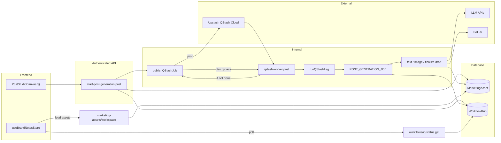

# QStash 后台长任务架构 — 技术检索文档（AI / 工程师）

> **用途**：新会话中的 Coding AI 阅读本文后应能：① 理解推文生成等长任务的端到端架构；② 按调用栈与数据流定位问题；③ 按约定扩展新 Job 类型。  
> **范围**：`POST_GENERATION`（推文 Studio）已实现；**社交发布与运维类 Job**（`SOCIAL_PUBLISH`、`SOCIAL_METRICS_SYNC` 等）已接入同一 worker；视频/文章等预留同一框架。  
> **历史**：项目曾尝试 Vercel Workflow，因 Prisma 在 Step Lambda 中的 engine 分发等问题弃用；当前以 **Upstash QStash + 自接力 Worker** 为正式方案。  
> **版本说明（2026-06）**：补充 **`selfDispatching`** 与 worker **双驱动排障**、已注册 **SOCIAL_*** Job 表、Facebook metrics 抓取要点；配图推文步进仍以 `[Social_Post_Generation_Technical_Reference.md](./Social_Post_Generation_Technical_Reference.md)` 为准（`IMAGE_SUBMIT` / `IMAGE_POLL`，非下文过时示例中的 `POST_GEN_IMAGE`）。

---

## 1. 核心设计原则（必读）

| 原则 | 含义 |
|------|------|
| **一棒 = 一步（One leg = one step）** | 每次 HTTP 进入 worker 只执行 **一个** `QStashStepDescriptor`（或 SOCIAL Job 内的一个 `ctx.step`），满足 Serverless 单次请求时间上限；长流水线靠多次调度串联。 |
| **自接力（Self-relay）** | 单步完成后若 `runQStashLeg` 返回 `done: false` 且 Job **未**标记 `selfDispatching`，`qstash-worker` 调用 `publishQStashJob` 再次投递 **同一** `QStashJobPayload`（默认 `delaySeconds: 2`）。 |
| **`selfDispatching`（2026-06）** | Job 在 `executeStep` **内部**已 `publishQStashJob` 下一棒（带正确 `ctx.step` / `windowIndex` 等）。worker **禁止**再 auto-relay，否则与内层调度形成 **双驱动平行链**（~2s 重复执行同一步）。 |
| **双存储** | **权威业务状态**在 `MarketingAsset.contentPayload`（草稿、`globalState`、每张图进度）；**轮询/UI 汇总**在 `WorkflowRun`（`status`、`progress`）。社交发布另以 **`SocialPublishRecord`** 为权威。 |
| **写库必须合并** | 更新 `contentPayload` 时 **禁止整对象覆盖**，必须 `read → { ...prev, globalState, drafts }`，否则前端失去 `assetType` 等分类字段。 |
| **Generic 框架** | `runner` / `publisher` / `types` 与具体业务解耦；新业务 = 新目录 + `registerQStashJob`。 |

---

## 2. 架构全景（组件关系）



---

## 3. 目录与文件地图（按职责）

| 路径 | 职责 |
|------|------|
| `server/utils/qstash/types.ts` | `QStashJobPayload`、`QStashStepDescriptor`、`QStashJobDefinition`（含 **`selfDispatching?: boolean`**）契约。 |
| `server/utils/qstash/publisher.ts` | **唯一**发布下一棒：dev 用 `$fetch` + 长 `timeout`；prod 用 `@upstash/qstash` `Client`，**必须**传 `baseUrl`（区域 token 匹配）。 |
| `server/utils/qstash/runner.ts` | Job 注册表、`verifyInternalSecret`、`runQStashLeg`（load → findNextStep → executeStep 或 onComplete）。 |
| `server/utils/qstash/jobs/index.ts` | `registerAllJobs()` — 新增 Job 在此 `registerQStashJob(...)`。 |
| `server/utils/qstash/jobs/post-generation/` | 推文生成：状态机、`state.ts`、各 `steps/`。 |
| `server/api/internal/qstash-worker.post.ts` | 内部入口：`registerAllJobs()` → 验 secret → `runQStashLeg` → **仅当** `!done && !stepFailed && !selfDispatching` 时 `publishQStashJob(body, { delaySeconds: 2 })`。 |
| `server/utils/qstash/jobs/social-publish.ts` | `SOCIAL_PUBLISH` — 发帖、重试、`updateMarketingAssetDraftStatus`、成功后链式 `SOCIAL_METRICS_SYNC`。 |
| `server/utils/qstash/jobs/social-metrics-sync.ts` | `SOCIAL_METRICS_SYNC` — 多时间窗 snapshot 写入 `latestMetricSnapshot`。 |
| `server/utils/qstash/jobs/social-recovery.ts` | `SOCIAL_RECOVERY_SCAN` — 卡死记录 / 锁过期恢复（日 cadence 自调度）。 |
| `server/utils/qstash/jobs/social-token-refresh.ts` | `SOCIAL_TOKEN_REFRESH` — 令牌刷新（自调度）。 |
| `server/utils/qstash/jobs/campaign-metrics-sync.ts` | `CAMPAIGN_METRICS_SYNC` — 广告 campaign metrics。 |
| `server/utils/qstash/jobs/social-first-comment.ts` | `SOCIAL_FIRST_COMMENT` — 首评。 |
| `server/api/brand-note/workspaces/[id]/workflows/start-post-generation.post.ts` | 用户发起：合并写入 `contentPayload`、创建 `WorkflowRun`、首棒 `publishQStashJob`。 |
| `server/api/workflows/[id]/status.get.ts` | 前端轮询 `WorkflowRun` 摘要。 |
| `server/api/marketing-assets/workspace/[workspaceId].get.ts` | 列表映射 DB → `GeneratedAsset`；`globalState === 'processing'` → 卡片 `status: processing`（响应体本身 historically **无** `workspaceId`，由前端 store stamp 补齐，见 §10）。 |

---

## 4. 端到端调用栈（推荐调试顺序）

### 4.1 发起任务

1. **前端**：`components/brand-notes/content-studio/PostStudioCanvas.vue` → `POST .../workflows/start-post-generation` body：`assetId`、`drafts`、`generationContext`。
2. **服务端**：`start-post-generation.post.ts`
   - `protectRoute` 鉴权；
   - `MarketingAsset.update`：`{ ...prevPayload, globalState: 'processing', drafts: initialDrafts }`；
   - `prisma.workflowRun.create`：`jobId` = `workflowRun.id`，`type` = `POST_GEN_JOB_TYPE`（`'POST_GENERATION'`）；
   - `publishQStashJob({ jobType, jobId: workflowRun.id, ctx, internalSecret }, { delaySeconds: 0 })`。
3. **返回**：`{ workflowRunId }` — 前端据此 `startPostWorkflowPolling`。

### 4.2 每一棒（Worker）

1. **URL**：`POST {NUXT_PUBLIC_APP_URL}/api/internal/qstash-worker`（由 QStash 或 dev-bypass 调用）。
2. **载荷**：`QStashJobPayload`：`jobType`、`jobId`（= `WorkflowRun.id`）、`ctx`（`PostGenContext` 等）、`internalSecret`。
3. **流程**：`qstash-worker.post.ts` → `verifyInternalSecret` → `runQStashLeg`：
   - `loadState(jobId, ctx)` → `findNextStep(state)`（或 SOCIAL Job 按 `ctx.step` 状态机）；
   - 若 `nextStep === null` / 步骤链结束 → `onComplete` → `done: true`；
   - 否则 `executeStep` → 通常 `done: false`；
   - **Worker 末尾 auto-relay（仅 relay-driven Job）**：

```typescript
const shouldRelay =
  !result.done &&
  !result.stepFailed &&
  !result.selfDispatching   // ← 2026-06：阻断双驱动

if (shouldRelay) {
  await publishQStashJob(body, { delaySeconds: 2 })
}
```

4. **`RunLegResult.selfDispatching`**：`runner.ts` 从 `QStashJobDefinition.selfDispatching` 透传；与 Job 定义一致。

**排障关键词**：Vercel 内存暴涨 + `max client connections` + DLQ 堆积 → 查是否某 `selfDispatching` Job 被误 auto-relay（日志中同 `jobId`/`recordId` 每 ~2s 一条）。

### 4.3 POST_GENERATION 状态机（`post-generation/index.ts`）

> 配图步已迁移为 **`POST_GEN_IMAGE_SUBMIT`** + **`POST_GEN_IMAGE_POLL`**（并行批内多图），详见 [Social_Post_Generation_Technical_Reference.md](./Social_Post_Generation_Technical_Reference.md) §7。  
> `POST_GENERATION` **未**设置 `selfDispatching` — 步进由 worker auto-relay 驱动。

| `draft.status` | 下一步 Step（概要） |
|----------------|-------------------|
| `text_pending` | `POST_GEN_TEXT` |
| `image_pending` | SUBMIT 批 / POLL 轮询 / 全部 settle 后 `POST_GEN_FINALIZE_DRAFT` |
| `completed` / `error` | 跳过该 draft |
| 全部 draft 终态 | `findNextStep` → `null` → `onComplete` |

### 4.4 关键 Step 实现（POST_GENERATION 文件索引）

| Step | 文件 | 要点 |
|------|------|------|
| TEXT | `steps/text.ts` | `generatePostPipeline`；`tracingCtx.workspaceId`；写入 `imageCreativesList`。 |
| IMAGE SUBMIT | `steps/image-submit.ts` | 并行 `fal.queue.submit`；**`refreshSupabaseSignedUrls`**。 |
| IMAGE POLL | `steps/image-poll.ts` | `status/result`；串行 `consumeCredits`；软失败。 |
| FINALIZE | `steps/finalize-draft.ts` | `draft.status = 'completed'`。 |

**已删除**：`steps/image.ts`、`POST_GEN_IMAGE` 单步 — 勿引用。

### 4.5 已注册 Job 类型与 `selfDispatching`（`jobs/index.ts`）

| `jobType` | 定义文件 | `selfDispatching` | 步进方式 |
|-----------|----------|-------------------|----------|
| `POST_GENERATION` | `post-generation/` | 否（默认） | Worker auto-relay + `findNextStep` |
| `SOCIAL_PUBLISH` | `social-publish.ts` | **是** | `executeStep` 内按 `ctx.step` 自调度（`CHECK_QUOTA` → `ACQUIRE_LOCK` → `PUBLISH_*` → …） |
| `SOCIAL_METRICS_SYNC` | `social-metrics-sync.ts` | **是** | 按 `windowIndex` 自调度下一时间窗 |
| `SOCIAL_RECOVERY_SCAN` | `social-recovery.ts` | **是** | 扫描结束后自调度下一日 |
| `SOCIAL_TOKEN_REFRESH` | `social-token-refresh.ts` | **是** | 刷新周期自调度 |
| `CAMPAIGN_METRICS_SYNC` | `campaign-metrics-sync.ts` | **是** | Campaign 级自调度 |
| `SOCIAL_FIRST_COMMENT` | `social-first-comment.ts` | 否 | 单次 leg；由 `SOCIAL_PUBLISH` 成功后触发 |

**新增 Job  checklist 补充**：

- 若在 `executeStep` 内 **自行** `publishQStashJob` 下一棒 → 必须在 Job 定义上设 **`selfDispatching: true`**。
- 若完全依赖 worker 用 **不变** `body` 推进 `findNextStep` → 保持默认 `false` / 省略。

### 4.6 SOCIAL_PUBLISH → 前端状态与 metrics 链（摘要）

1. **用户 API**：`POST .../social/publish` 创建 `SocialPublishRecord`（`contentSnapshot.draftId` = `PostDraftRow.id`），`status` 初始 `PENDING`，并 `publishQStashJob(SOCIAL_PUBLISH)`。
2. **前端乐观**：`PostStudioCanvas` 将选中草稿 `publicationStatus` 置 `'published'`，聚合顶层 → `PUBLISHED`（卡片 in-flight）。
3. **Worker 成功**：`updateMarketingAssetDraftStatus(..., { publicationStatus: 'posted', platformPostUrl, ... })`；聚合 → `POSTED`；记录 `status: 'PUBLISHED'` + `externalUrl`。
4. **Metrics**：成功后 `publishQStashJob(SOCIAL_METRICS_SYNC, { windowIndex: 0 })`；Facebook `fetchPostMetrics` 分 engagement / insights（见 Social Post 文档 §9.5）。
5. **UI**：`GeneratedDetailDialog` 用 **草稿级** `publicationStatus` 显示 icon；`PublishedPostMetrics` 读 `publish-records` API（`marketingAssetId` + `draftId` 过滤）。

完整 OAuth / 绑定 / v3 CAS → [Social_Account_Binding_And_Publishing_Technical_Reference.md](./Social_Account_Binding_And_Publishing_Technical_Reference.md)。

### 4.7 POST_GENERATION 持久化

- **`loadPostGenState`**：按 `ctx.assetId` 读 `MarketingAsset.contentPayload`。
- **`savePostGenState`**：merge `contentPayload`，保留 `assetType` 等字段。
- **`updateWorkflowProgress`**：更新 `WorkflowRun.status` 与 `progress.completed` / `total`。

---

## 5. 环境与配置

| 变量 | 用途 |
|------|------|
| `NUXT_PUBLIC_APP_URL` | 生产必须是 **公网 HTTPS** 根 URL；QStash **不能**回调 localhost / loopback。 |
| `NUXT_QSTASH_TOKEN` | QStash API token。 |
| `NUXT_QSTASH_URL` | **区域 Base URL**（例如美东 `https://qstash-us-east-1.upstash.io`）；缺省会走错区域 → `user not found in this region`。 |
| `WORKFLOW_INTERNAL_SECRET` | Worker 与 start API 共用；勿暴露给浏览器。 |
| `NUXT_FALAI_KEY` | 图片步 FAL 调用。 |

`nuxt.config.ts` → `runtimeConfig`：`falaiKey`、`qstashToken`、`qstashUrl`、`public.appUrl`。

---

## 6. 开发环境 vs 生产

| 模式 | 触发条件 | 行为 | 适用场景 |
|------|----------|------|----------|
| **Local QStash Mode** | `NODE_ENV != production` + `QSTASH_DEV=true` | 向 `http://localhost:8080`（QStash CLI）发布真实消息；CLI 投递给 `localhost:3000/worker` | **推荐用于验证 relay 链 / selfDispatching / delay** |
| **Dev Bypass** | `NODE_ENV != production`，`QSTASH_DEV` 未设置 | `setTimeout + $fetch` 直接调 worker | 日常快速迭代，无需启动额外进程 |
| **生产** | `NODE_ENV = production` | 云端 `@upstash/qstash` Client | 线上 |

### Local QStash Mode 启动步骤

```bash
# 终端 A — QStash 本地服务器（port 8080，模拟 Upstash 云）
npx @upstash/qstash-cli dev

# 终端 B — Nuxt（port 3000）
npm run dev
```

在 `.env.development` 取消注释 `QSTASH_DEV=true`，然后在 Upstash Console → QStash → 顶部区域下拉 → **Local Mode** → 输入 `http://localhost:8080` 即可监控消息与日志。

> **端口说明（不可混淆）**  
> Port **3000** = Nuxt 应用（`qstash-worker` 在这里）  
> Port **8080** = QStash CLI 本地服务器（将消息投递给 3000）  
> 二者是独立进程，端口不能相同。

---

## 7. 本会话相关问题与修复登记（检索词 → 结论）

| 现象 / 关键词 | 根因 | 修复位置 / 策略 |
|---------------|------|-----------------|
| `user not found in this region` | QStash Client 默认区域与 token 区域不一致 | `publisher.ts` 传入 `config.qstashUrl` |
| `loopback address ::1` / localhost | QStash 无法访问本机 | dev-bypass；生产 `appUrl` 公网 |
| dev `fetch failed` / `<no response>` | in-process `$fetch` 默认超时短于单棒 LLM 耗时 | `publisher.ts` `timeout: 600_000` |
| 推文保存后类型错 / 非 `social-post-draft` | `contentPayload` 被 **覆盖** 丢失 `assetType` | `start-post-generation.post.ts`、`savePostGenState` spread-merge |
| FAL `422` 难查 | 日志过简 | `image-submit.ts` / `image-poll.ts` 打 status、body、prompt 头等 |
| 重复 Facebook 帖 / metrics 风暴 / DB `EMAXCONN` | `selfDispatching` Job 被 worker **二次** relay | `types.ts` + 各 SOCIAL Job `selfDispatching: true`；`qstash-worker` 条件 relay（§4.2） |
| Facebook metrics 全失败 `(#100)` | 请求废弃 insights 字段 | `facebook.ts` 分路 + insights 可选 |
| LangSmith `workspaceId: unknown` | pipeline 未收 `tracingCtx` | `steps/text.ts` `tracingCtx: { workspaceId: ctx.workspaceId }` |
| 多 workspace 看到「生成中」卡片 | 全局 `generatedAssets` + API 资产无 `workspaceId` + 过滤宽松 | `useBrandNotesStore.ts`：`loadWorkspaceAssets` **stamp** `workspaceId`；`stillProcessing` **严格** `a.workspaceId === workspaceId`；各 `addGeneratedAsset`/占位符注入补 `workspaceId` |

---

## 8. 问题定位速查（症状 → 先看哪里）

| 症状 | 优先检查 |
|------|-----------|
| 任务从不开始 | `start-post-generation` 是否返回 200；`publishQStashJob` 是否抛错；生产 token/baseUrl。 |
| 只跑一棒就停 | `qstash-worker` 日志；`runQStashLeg` 是否 `done: true` 过早；`loadState` 是否 `null`。 |
| 草稿一直 `text_pending` | `steps/text.ts` / `generatePostPipeline` 异常；Prisma 是否写入失败。 |
| 图全失败 | `steps/image.ts` 日志；FAL key；提示词/参考图合规。 |
| 前端卡片类型错 | `MarketingAsset.contentPayload.assetType` 是否存在；是否某处 `update` 未 merge。 |
| 轮询一直 PENDING | `updateWorkflowProgress` 是否被调用；`WorkflowRun.id` 是否与 payload `jobId` 一致。 |
| 切换 workspace 仍见生成中 | `useBrandNotesStore` `loadWorkspaceAssets` 与 processing 占位符是否都带 `workspaceId`。 |
| 同帖重复发 20+ 次 / metrics Job 打满 Vercel | Worker 对 `selfDispatching` Job 仍 auto-relay | 确认 Job 定义 `selfDispatching: true`；`qstash-worker` `shouldRelay` 含 `!result.selfDispatching`；清空 DLQ 后重试 |
| `SOCIAL_METRICS_SYNC` 不更新 / Facebook `(#100) insights` | 无效 metric 名导致整次失败（历史） | `facebook.ts` 仅 `post_impressions,post_impressions_unique,post_clicks`；insights `try/catch` 降级 |
| 详情页已发布却显示草稿（本地） | UI 误用 `publish-records` 判发布 | 用 `drafts[].publicationStatus`；见 Social Post 文档 §8.5 |

---

## 9. 新增长耗时任务 — 实现清单（Copy for AI）

1. **`server/utils/qstash/jobs/<task-name>/types.ts`**  
   定义 `jobType` 常量、`*State`、`*Context`、step 常量。
2. **`state.ts`（如需要）**  
   选定权威存储（多数字段建议 DB JSON + merge，避免覆盖无关键）。
3. **`index.ts`**  
   实现 `QStashJobDefinition`：`loadState`、`findNextStep`、`executeStep`、`onComplete`（可选 `onFatalError`）。
4. **`server/utils/qstash/jobs/index.ts`**  
   `registerQStashJob(YOUR_JOB)`。
5. **对外 API**  
   用户入口：鉴权 → 初始化 DB → 创建 `WorkflowRun`（若需统一轮询）→ `publishQStashJob` 首棒。  
   **不要**改 `qstash-worker.post.ts`（除非全局 relay 规则变更）；社交类 Job 通常由业务 API 直接 `publishQStashJob`。
6. **`selfDispatching`**  
   若 step 内多次 `publishQStashJob` 且 `ctx` 随步变化 → **`selfDispatching: true`**，禁止依赖 worker 用原 `body` 盲 relay。
7. **单步复杂度**  
   若单步可能超时，**拆成多个 step**（推文配图 SUBMIT/POLL；社交发布多 `ctx.step`）。
8. **前端**  
   轮询 `/api/workflows/:id/status` 或专用状态 API；列表刷新 `loadWorkspaceAssets`；processing 占位 **必须** `workspaceId`；发布详情见 Social Post 文档 §8.4–8.6。

---

## 10. 前端与 Store 约定（与 QStash 并列重要）

- **`generatedAssets`** 为 Pinia 全局列表；`loadWorkspaceAssets(workspaceId)` 合并 API 结果与内存中 `processing` 占位符。
- **必须**：API 返回的每条资产在 store 内映射为 `workspaceId: a.workspaceId ?? workspaceId`（因 `marketing-assets/workspace` 响应 historically 不含该字段）。
- **必须**：`stillProcessing` 仅保留 `a.workspaceId === workspaceId` 的 processing 项（fail-closed，防止跨 workspace 泄漏）。
- **推文占位**：`startPostWorkflowPolling` 注入的 placeholder 需带 `workspaceId`。
- **视频占位**：`addProcessingVideo(jobId, config, workspaceId)` 调用处传当前 workspace id。

---

## 11. 安全说明

- Worker 依赖 `internalSecret`；生产应设置强随机 `WORKFLOW_INTERNAL_SECRET`。
- 注释中已说明：可按需升级为 `@upstash/qstash` **Receiver** 验签（当前为轻量方案）。

---

## 12. 相关数据库概念（不修改 schema 前提下）

- **`WorkflowRun`**：`id` 即 QStash 载荷中的 `jobId`（**`POST_GENERATION`** 场景）；`type`、`status`、`progress`、`assetId`。
- **`MarketingAsset`**：`contentPayload` 含 Post Studio 的 `globalState`、`drafts`、`assetType: 'social_post_studio_batch'`、聚合/草稿级 `publicationStatus`、`_rev` 等。
- **`SocialPublishRecord`**：`SOCIAL_PUBLISH` / `SOCIAL_METRICS_SYNC` 权威行；`jobId` 常为 **`record.id`**（非 `WorkflowRun.id`）；`contentSnapshot.draftId` 关联 `PostDraftRow.id`；`latestMetricSnapshot` 供 `PublishedPostMetrics`。

---

## 13. 双驱动事故复盘（2026-06，必读）

**现象**：生产 Vercel `Provisioned Memory` 飙升；Prisma `FATAL: max client connections reached`；Upstash DLQ 堆积；同一 Facebook 帖重复数十条；`SOCIAL_METRICS_SYNC` 持续占用 worker。

**根因**：`SOCIAL_PUBLISH`、`SOCIAL_METRICS_SYNC` 等在 `executeStep` 末尾已 `publishQStashJob` 下一棒（正确 `ctx`），但 `qstash-worker` 对 **所有** `done: false` 结果仍用 **原始 `body`** 每 2s auto-relay → 与内层链 **并行**，同一步被反复执行。

**修复**：

1. `QStashJobDefinition.selfDispatching?: boolean`（`types.ts`）。
2. 上述社交/运维 Job 设 `selfDispatching: true`。
3. `runner.ts` → `RunLegResult.selfDispatching`。
4. `qstash-worker.post.ts`：`shouldRelay = !done && !stepFailed && !selfDispatching`。

**运维**：修复部署后建议清理 DLQ 中积压的重复 leg；历史帖 metrics 可能需手动 backfill（recovery 窗口约 4 天，见 `social-recovery.ts`）。

---

**文档版本**：与仓库 `selfDispatching` 契约、七类已注册 QStash Job、worker 条件 relay、SOCIAL 链路与发布后 UI/metrics 文档交叉引用保持一致；若新增 Job 或改动 worker 契约，请同步更新 §3–§9、§4.5–§4.6、§13。
