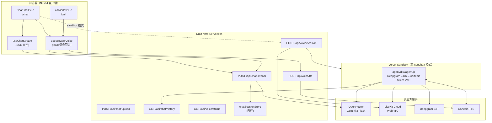

# AI Chat & AI Call — 技术架构文档

> **module-key**: `ai-chat-call`  
> **读者**: 后续接手的 AI / 全栈开发者  
> **最后更新**: 2026-05-30  
> **关联规范**: [QUICK_REFERENCE.md](../QUICK_REFERENCE.md) · [TECHNICAL_ARCHITECTURE.md](../TECHNICAL_ARCHITECTURE.md) · [AICodingRule.md](../AICodingRule.md) · [design/chat/DESIGN.md](../../design/chat/DESIGN.md)

---

## 0. 文档目的与范围

本文档记录 **面向终端用户** 的两条独立通道（非坐席工作台 `/app/*`）：

| 通道 | 路由 | UI 范式 | 主要能力 |
|------|------|---------|----------|
| **AI Chat** | `/chat`, `/chat/[sessionId]` | WhatsApp 手机端聊天 | 多模态文字聊天（SSE 流式）、会话列表、内嵌语音 overlay |
| **AI Call** | `/call` | iOS 拨号盘 + WhatsApp 语音通话 | 装饰性拨号 → 全屏实时语音（波形 + 字幕） |

**不在本文范围**: `/app/chatbot/*`（坐席侧 Chatbot 管理）、`/app/calls`（坐席通话记录 Mock）。

---

## 1. 系统总览

### 1.1 架构图



### 1.2 两种语音运行模式（必读）

| 模式 | 环境变量 | 谁处理 STT/LLM/TTS | 适用场景 |
|------|----------|-------------------|----------|
| **local** | `VOICE_AGENT_MODE=local` | 浏览器 `useBrowserVoice`（Web Speech API + `/api/chat/stream` + `/api/voice/tts`） | 本地开发、无需启动 LiveKit Agent |
| **sandbox** | `VOICE_AGENT_MODE=sandbox` | Vercel Sandbox 内 `agent/`（Deepgram + OpenRouter + Cartesia + Silero VAD） | Vercel 生产；长连接语音 |

> **当前默认 UI 路径**: `/chat` 与 `/call` 的语音均通过 **`useBrowserVoice`** 实现，**不依赖** 前端连接 LiveKit Room（即使 `sandbox` 模式已 spawn Agent，Call/Chat 页面仍未接 `useVoiceRoom`）。  
> Sandbox Agent 与 LiveKit 房间是为 **生产级全双工** 预留；若要让浏览器走 LiveKit，需在 `VoicePanel` / `ChatShell` 中切换为 `useVoiceRoom` + 轮询 `/api/voice/status`。

---

## 2. 路由、布局与页面

### 2.1 路由表

| 路由 | 文件 | Layout | 行为 |
|------|------|--------|------|
| `/chat` | `app/pages/chat/index.vue` | `chat` | 创建 `sess-*` ID，`replace` 到 `/chat/[sessionId]` |
| `/chat/:sessionId` | `app/pages/chat/[sessionId].vue` | `chat` | 渲染 `<ChatShell :session-id="..." />` |
| `/call` | `app/pages/call/index.vue` | `chat` | 拨号盘 → 通话页两阶段状态机 |

### 2.2 Layout

- **`app/layouts/chat.vue`**: 全屏、无坐席 Sidebar/Softphone；`min-h-screen` + Sonner Toaster。
- 设计：桌面端也 **居中 390px 手机框**（`max-w-[390px]`），符合 DEMO「一律移动端样式」要求。

### 2.3 与坐席端的链接

- `app/pages/app/chatbot/index.vue`: 展示近期 AI Chat 会话链接 → `/chat`
- `app/pages/app/calls/index.vue`: AI Agent 面板 Mock 链接 → `/chat` / `/call`

---

## 3. AI Chat 功能说明

### 3.1 用户可见功能

- WhatsApp 风格：绿色顶栏、气泡（用户 `#DCF8C6` 右对齐，AI 白底左对齐）、双勾、时间戳
- 多模态：图片/视频上传 → `POST /api/chat/upload` → data URL 送入 OpenRouter
- 流式回复：SSE `delta` / `done` 事件
- 会话：localStorage（`useChatSessions`）+ 服务端 `chatSessionStore`（供 Voice Agent 拉历史）
- 语音 overlay：Mic 按钮 → 全屏语音层（双波形 + 实时字幕），挂断回到文字
- 顶栏：跳转 `/call`、会话抽屉、返回工作台

### 3.2 调用栈（文字聊天）

```
用户按发送 / Enter
  → ChatShell.handleSend()
  → useChatStream.sendMessage()
  → fetch POST /api/chat/stream
       → chatSessionStore.appendMessage(user)
       → getOpenRouterClient().chat.completions.create({ stream: true })
       → ReadableStream SSE: data: {"type":"delta"|"done"|"error"}
  → onDelta / onDone 更新 messages ref
  → ChatShell 模板渲染气泡（renderMarkdown 轻量 ** / ` ）
```

### 3.3 调用栈（Chat 内语音 — local 管道）

```
用户点 Mic
  → ChatShell.startVoice()
  → useBrowserVoice.start(sessionId)
       → getUserMedia({ echoCancellation, noiseSuppression })
       → Web SpeechRecognition (lang zh-CN，兼听英文)
       → onend 校验通过 → handleUserSpeech()
            → POST /api/chat/stream (AbortController 可取消)
            → POST /api/voice/tts → Cartesia MP3 → Audio 播放
       → scheduleListen(ECHO_FADE_MS) 单入口重启 STT
```

### 3.4 关键前端文件

| 文件 | 职责 |
|------|------|
| `app/components/chat/ChatShell.vue` | WhatsApp UI、消息列表、Composer、语音 overlay |
| `app/components/chat/ChatComposer.vue` | 旧版 Composer（ChatShell 已内联输入栏，仍可用于其他入口） |
| `app/components/chat/MessageBubble.vue` | 单条气泡（ChatShell 当前内联渲染，组件仍保留） |
| `app/components/chat/AudioVisualizer.vue` | Canvas 环形波形 |
| `app/components/chat/VoicePanel.vue` | 独立语音全屏（旧 Chat 布局用；Call 页自包含 UI） |
| `app/composables/useChatStream.ts` | SSE 客户端 + 上传 |
| `app/composables/useChatSessions.ts` | localStorage 会话列表 |
| `app/composables/useBrowserVoice.ts` | 浏览器语音管道（核心） |
| `app/composables/useVoiceRoom.ts` | LiveKit 客户端（sandbox 生产路径预留，Chat/Call 默认未接） |
| `app/types/chat.ts` | `DisplayMessage` 类型（**禁止**从 `.vue` 的 script setup export 类型） |

### 3.5 关键服务端文件

| 文件 | 职责 |
|------|------|
| `server/api/chat/stream.post.ts` | SSE 流式 LLM + 持久化消息 |
| `server/api/chat/upload.post.ts` | 多模态文件 → data URL |
| `server/api/chat/history.get.ts` | Agent 拉会话历史 |
| `server/api/chat/sessions.get.ts` | 已知 session 列表 |
| `server/api/voice/tts.post.ts` | Cartesia TTS 代理（MP3） |
| `server/utils/openrouter.ts` | OpenRouter 客户端，`CHAT_MODEL` |
| `server/utils/chatSessionStore.ts` | 进程内 Map 会话存储 |
| `server/utils/livekitToken.ts` | LiveKit JWT（`await toJwt()`） |

---

## 4. AI Call 功能说明

### 4.1 用户可见功能

**Phase `dialer`**:
- 深色拨号盘（`#111b21`）、12 键、号码展示、删除、清空
- 绿色拨打 → 进入通话；右侧图标跳转 `/chat`

**Phase `incall`**:
- 头像、号码、计时器、状态 Pill（连接中/聆听/思考/说话）
- **AI 区**: `AudioVisualizer` + 最近 AI 字幕（`aiTurns`）
- **用户区**: 麦克风波形 + 用户字幕（`userTurns`）
- 静音 / 挂断 / 文字聊天

### 4.2 调用栈

```
用户点绿色拨打
  → startCall()
  → useBrowserVoice.start(`call-${Date.now()}`)
  → 与 Chat 语音相同管道（独立 sessionId，无文字历史 UI 同步）

用户挂断
  → hangUp() → stopBV() → phase = 'dialer'
```

> Call 页 **未调用** `/api/voice/session` 与 LiveKit；与 Chat 一样走 **local 浏览器管道**。  
> 若生产要 Sandbox + LiveKit，需在 `startCall()` 中增加：创建 session → 轮询 status → `useVoiceRoom.connect()`。

### 4.3 关键文件

| 文件 | 职责 |
|------|------|
| `app/pages/call/index.vue` | 拨号 + 通话 UI + `useBrowserVoice` 绑定 |

---

## 5. LiveKit Agent（`agent/` 子项目）

### 5.1 管道

```
用户麦克风 → LiveKit Room
  → Silero VAD（allow_interruptions: true，真 barge-in）
  → Deepgram STT (nova-2)
  → OpenRouter LLM (google/gemini-3-flash-preview)
  → Cartesia TTS
  → LiveKit 下行音频
```

### 5.2 上下文衔接（Chat → Voice）

```
agent 启动时:
  SESSION_ID, NUXT_BASE_URL 来自 Sandbox env
  → GET {NUXT_BASE_URL}/api/chat/history?sessionId=
  → buildSystemPrompt(history, AGENT_LANGUAGE)
```

### 5.3 Agent 文件

| 文件 | 职责 |
|------|------|
| `agent/src/agent.ts` | LiveKit Agent 入口、语言配置、`AgentSession.start` |
| `agent/src/llm.ts` | OpenRouter 作为 LiveKit LLM 插件 |
| `agent/src/prompt.ts` | 语音 System Prompt + 历史注入 |
| `agent/package.json` | 独立依赖；Sandbox 内 `npm install && npm run build` |

### 5.4 本地手动运行 Agent（可选）

```bash
cd agent
npm install
npm run build
# 配置 .env: LIVEKIT_*, OPENROUTER_*, DEEPGRAM_*, CARTESIA_*, SESSION_ID, NUXT_BASE_URL
node dist/agent.js dev
```

---

## 6. 第三方依赖与服务

### 6.1 npm 包（主项目 `package.json`）

| 包 | 用途 |
|----|------|
| `openai` | OpenRouter 兼容客户端（服务端） |
| `livekit-client` | 浏览器 WebRTC（`useVoiceRoom`，预留） |
| `livekit-server-sdk` | 签发 Room Token |
| `@vercel/sandbox` | 按需创建 Agent 微 VM |
| `marked` | Markdown（部分组件） |
| `nanoid` | 消息 ID |

### 6.2 npm 包（`agent/package.json`）

| 包 | 用途 |
|----|------|
| `@livekit/agents` | Agent 框架 |
| `@livekit/agents-plugin-deepgram` | STT |
| `@livekit/agents-plugin-cartesia` | TTS |
| `@livekit/agents-plugin-silero` | VAD |
| `openai` | OpenRouter LLM 插件底层 |

### 6.3 外部 SaaS

| 服务 | 用途 | 配置变量 |
|------|------|----------|
| **OpenRouter** | LLM `google/gemini-3-flash-preview` | `OPENROUTER_API_KEY` |
| **LiveKit Cloud** | WebRTC 房间与媒体 | `LIVEKIT_URL`, `LIVEKIT_API_KEY`, `LIVEKIT_API_SECRET` |
| **Deepgram** | Agent STT | `DEEPGRAM_API_KEY` |
| **Cartesia** | TTS（服务端代理 + Agent） | `CARTESIA_API_KEY` |
| **Vercel Sandbox** | 长时运行 Agent 进程 | `VERCEL_OIDC_TOKEN`（生产自动注入） |

### 6.4 浏览器 API（local 模式）

| API | 用途 |
|-----|------|
| `SpeechRecognition` / `webkitSpeechRecognition` | STT |
| `AudioContext` + `AnalyserNode` | VAD、波形电平 |
| `getUserMedia` | 麦克风（`echoCancellation: true`） |
| `HTMLAudioElement` | 播放 Cartesia MP3 |
| `speechSynthesis` | Cartesia 失败时的 TTS 回退 |

---

## 7. 环境变量

参考项目根目录 `.env`（勿提交密钥到 Git）。

| 变量 | 必填 | 说明 |
|------|------|------|
| `OPENROUTER_API_KEY` | 是 | 文字 + 语音 LLM |
| `LIVEKIT_URL` | sandbox 是 | `wss://xxx.livekit.cloud` |
| `LIVEKIT_API_KEY` | sandbox 是 | |
| `LIVEKIT_API_SECRET` | sandbox 是 | |
| `DEEPGRAM_API_KEY` | sandbox 是 | Agent STT |
| `CARTESIA_API_KEY` | 推荐 | `/api/voice/tts` + Agent TTS |
| `VOICE_AGENT_MODE` | 是 | `local` \| `sandbox` |
| `VOICE_AGENT_GIT_URL` | sandbox 是 | 如 `https://github.com/.../Eazzy-Omini-CC` |
| `AGENT_LANGUAGE` | 否 | `en-US` \| `zh-CN` \| `multi`（Agent 用） |
| `VERCEL_OIDC_TOKEN` | 本地 sandbox 测试 | `vercel env pull`；**Vercel 生产自动注入** |

`nuxt.config.ts` → `runtimeConfig` 映射上述变量；`public.livekitUrl` 暴露给客户端。

---

## 8. System Prompt 配置位置

| 场景 | 文件 | 修改对象 |
|------|------|----------|
| **文字聊天** | `server/api/chat/stream.post.ts` | 常量 `SYSTEM_PROMPT`（约第 19–23 行） |
| **语音 Agent（Sandbox / 本地 agent）** | `agent/src/prompt.ts` | `buildSystemPrompt()` 内 `base` 字符串 + `LANG_INSTRUCTIONS` |
| **语音 Agent LLM 模型** | `agent/src/llm.ts` | OpenRouter 模型 ID |
| **文字聊天模型** | `server/utils/openrouter.ts` | `CHAT_MODEL = 'google/gemini-3-flash-preview'` |

修改后：
- 文字：重启 `nuxt dev` 即可
- Agent：重新 `npm run build` in `agent/`，Sandbox 需重新部署或等新 Sandbox 实例

---

## 9. Vercel Sandbox 详解

### 9.1 为什么需要 Sandbox

Vercel **Serverless Function** 执行时间上限约 **10–60 秒**，无法维持数分钟的 WebRTC + STT + TTS 管道。  
**Sandbox** = 按需创建的 **Firecracker 微 VM**（默认 `node24`），可 `detached` 长跑 Agent，通话结束后 TTL 销毁。

官方参考: [How to build an on-demand voice agent with Vercel Sandbox](https://vercel.com/kb/guide/how-to-build-an-on-demand-voice-agent-with-vercel-sandbox) · [Vercel Sandbox Docs](https://vercel.com/docs/sandbox)

### 9.2 一次通话的 Sandbox 生命周期

```
POST /api/voice/session  (mode=sandbox)
  │
  ├─ createLivekitToken() → 返回 token, roomName, sandboxId
  │
  └─ sandboxManager.spawnAgent() [异步，不阻塞响应]
        │
        ├─ status: creating
        ├─ Sandbox.create({ runtime: node24, source: git sparseCheckoutDir: agent })
        ├─ status: installing  → npm install (cwd: /vercel/sandbox/agent)
        ├─ npm run build
        ├─ status: starting    → node dist/agent.js start (detached: true)
        └─ status: ready       → Agent 连接 LiveKit，等待用户

前端轮询 GET /api/voice/status?sandboxId=...
  → ready === true 后连接 LiveKit（若已实现 useVoiceRoom）

约 10 分钟后 Sandbox 过期（代码 timeout: 10min；registry 15min 清理）
```

### 9.3 `sandboxManager.ts` 要点

- 内存 `Map` 存状态（**非持久化**；多实例部署时状态不共享 — 生产需 Redis 等，当前 DEMO 可接受）
- `sparseCheckoutDir: 'agent'` 只拉 agent 子目录
- 环境注入：`SESSION_ID`, `ROOM_NAME`, `NUXT_BASE_URL`, `AGENT_LANGUAGE`, 以及全部 API Keys

### 9.4 认证

| 环境 | `VERCEL_OIDC_TOKEN` |
|------|---------------------|
| Vercel Production | 平台自动注入，**无需**在 Dashboard 手动添加 |
| 本地测试 Sandbox | `vercel link` + `vercel env pull .env.local` |

### 9.5 部署步骤清单（不执行，仅文档）

1. **GitHub**: 提交并 push，确保 `agent/` 目录在仓库内  
2. **Vercel**: Import 项目，Framework = Nuxt  
3. **Environment Variables**（Production + Preview + Development）:
   - `OPENROUTER_API_KEY`, `LIVEKIT_*`, `DEEPGRAM_API_KEY`, `CARTESIA_API_KEY`
   - `VOICE_AGENT_MODE=sandbox`
   - `VOICE_AGENT_GIT_URL=https://github.com/<org>/<repo>.git`
   - `AGENT_LANGUAGE=multi`（或 `zh-CN` / `en-US`）
4. **不要**手动填 `VERCEL_OIDC_TOKEN`（生产自动）  
5. `vercel --prod` 或 Dashboard Redeploy  
6. 验证: `/chat` 文字 SSE；`/call` 语音；Dashboard → **Sandboxes** 查看实例日志  
7. 冷启动预期 **20–40 秒**（install + build）

### 9.6 本地 vs 生产对照

| 项 | 本地 `local` | Vercel `sandbox` |
|----|--------------|------------------|
| 语音实现 | `useBrowserVoice` | Agent in Sandbox（若 UI 接 LiveKit） |
| STT | Web Speech API | Deepgram |
| TTS | `/api/voice/tts` → Cartesia | Cartesia in Agent |
| Barge-in | Web Audio VAD + 内容回声过滤 | Silero VAD |
| 启动延迟 | 即时 | ~20–40s |
| 费用 | API 用量 | Sandbox CPU 时间 + API |

---

## 10. 问题记录与修复逻辑（开发必读）

以下按 **根因类别** 归纳，避免重复踩坑。

### 10.1 编译 / 模块加载

| 现象 | 根因 | 修复 |
|------|------|------|
| `ChatShell.vue` 404，页面白屏 | `<script setup>` 内 `export interface` 非法 | 类型移至 `app/types/chat.ts` |
| `[plugin:vite:vue] Illegal '/' in tags` | template 内联 SVG data-URI 含 `/` 和 `'` | 背景改到 `<style scoped>` 的 `.chat-thread-bg` |
| 组件 `VoicePanel` 找不到 | Nuxt 组件 pathPrefix | `nuxt.config` `components.dirs[].pathPrefix: false` |
| `toJwt()` 未 await | livekit-server-sdk v2 异步 | `createLivekitToken` async + await |

### 10.2 OpenRouter / 模型

| 现象 | 根因 | 修复 |
|------|------|------|
| 404 `google/gemini-flash-1.5` | 模型 ID 错误 | 统一为 `google/gemini-3-flash-preview` |

### 10.3 语音 local 管道 — 无回复 / 卡死

| 现象 | 根因 | 修复 |
|------|------|------|
| 说完 Hello 一直 Listening | `VOICE_AGENT_MODE=local` 但未跑 Agent；UI 曾只连 LiveKit | 实现完整 `useBrowserVoice` |
| SSE 结束无 `done` | 流异常关闭 | `useChatStream` 安全网 `onDone(accumulated)` |
| 第二轮重复念第一轮 | `stopAudio()` 不触发 `onended`，Promise 挂起 | `ttsResolve` 在 `stopAudio` 里立即 resolve |
| 第三轮完全无响应 | 双 `handleUserSpeech` + 双 Recognition 实例 | `handling` 锁 + `scheduleListen` 单入口 + 拆旧 recognition |
| 幻觉「晚上好」等 | STT 对噪声编造短语 | VAD `speechDetectedThisTurn` 能量门控 |
| AI 回复被当成用户输入 | 扬声器回声录入 STT | ① AEC ② `ECHO_FADE_MS` ③ **`isEchoOfAi()` LCS≥50%** 对比 `recentAiTexts` |
| 两人同时说话（双 TTS） | `onend` 双触发 + `ttsBusy` 未锁 | `endFired` + `ttsBusy` + `ownedLock` 再 `scheduleListen` |
| 中文机器音 | 虚构 Cartesia voice ID → 回退浏览器 TTS | 统一 voice `a0e99841-...` + `sonic-multilingual` |
| Barge-in 需按键 | 仅手动 interrupt | VAD 循环 + `abortCurrentPipeline` |

### 10.4 UI / i18n

| 现象 | 修复 |
|------|------|
| `<button>` 嵌套 `<button>` | 会话列表外层改 `div role="button"` |
| i18n 不刷新 | `computed` + `void locale.value` |
| 新 key 显示 raw | 三语言文件**末尾**追加 `chat.*` / `voice.*` / `call.*` |

### 10.5 `useBrowserVoice` 核心守卫（逆向验证清单）

接受一条用户语音 **当且仅当**：

1. `!stopped && !handling`（pipeline 锁）
2. `rec.onend` 且 `!endFired` 且 `rec === recognition`（实例有效）
3. `text` 非空，`!aiSpeaking.value`
4. `speechDetectedThisTurn === true`（能量验证）
5. `!isEchoOfAi(text)`（内容回声过滤）
6. TTS 播放：`!ttsBusy`，播放结束 `ttsBusy = false`

---

## 11. API 契约速查

### POST `/api/chat/stream`

```json
{ "sessionId": "sess-xxx", "messages": [{ "role": "user", "content": "..." }] }
```

SSE: `data: {"type":"delta","content":"..."}` → `data: {"type":"done","content":"..."}`

### POST `/api/voice/tts`

```json
{ "text": "...", "language": "en" | "zh" }
```

响应: `audio/mpeg` 二进制

### POST `/api/voice/session`

```json
{ "sessionId": "...", "participantName": "User" }
```

响应: `{ "token", "roomName", "sandboxId", "livekitUrl", "mode" }`

### GET `/api/voice/status?sandboxId=`

响应: `{ "sandbox": { "status": "creating"|"installing"|"starting"|"ready"|"error" }, "ready": boolean }`

---

## 12. Nuxt 配置要点

```ts
// nuxt.config.ts（摘录）
components: { dirs: [{ path: '~/components', pathPrefix: false }] },
runtimeConfig: { openrouterApiKey, livekit*, deepgram*, cartesia*, voiceAgentMode, voiceAgentGitUrl, public: { livekitUrl } },
nitro: { routeRules: { '/api/chat/stream': { headers: { 'Cache-Control': 'no-cache' } } } },
vite: { optimizeDeps: { include: ['livekit-client', 'marked', 'nanoid', ...] } },
```

---

## 13. 后续 AI 开发建议

1. **改 Prompt**: 先确认改「文字」还是「语音 Agent」，见 §8  
2. **改语音质量**: 生产优先 Sandbox + Deepgram/Cartesia；local 仅 DEMO  
3. **Call/Chat 接 LiveKit**: 在 `startCall` / `startVoice` 中 `fetch /api/voice/session` → 轮询 status → `useVoiceRoom`  
4. **多实例部署**: `chatSessionStore` 与 `sandboxManager` registry 需外置存储  
5. **勿在 Vue template 写复杂 data-URI**；共享类型放 `app/types/*.ts`  
6. **i18n**: 遵循 QUICK_REFERENCE §1.6  

---

## 14. 相关文档索引

| 文档 | 链接 |
|------|------|
| 全局架构 | [TECHNICAL_ARCHITECTURE.md](../TECHNICAL_ARCHITECTURE.md) |
| 速查 + 模块文档规范 | [QUICK_REFERENCE.md](../QUICK_REFERENCE.md) |
| 聊天视觉 | [design/chat/DESIGN.md](../../design/chat/DESIGN.md) |
| 模块索引 | [modules/README.md](./README.md) |

---

*本文档随 AI Chat/Call 功能演进维护；重大架构变更请同步更新 §10 问题表与 §9 Sandbox 节。*
